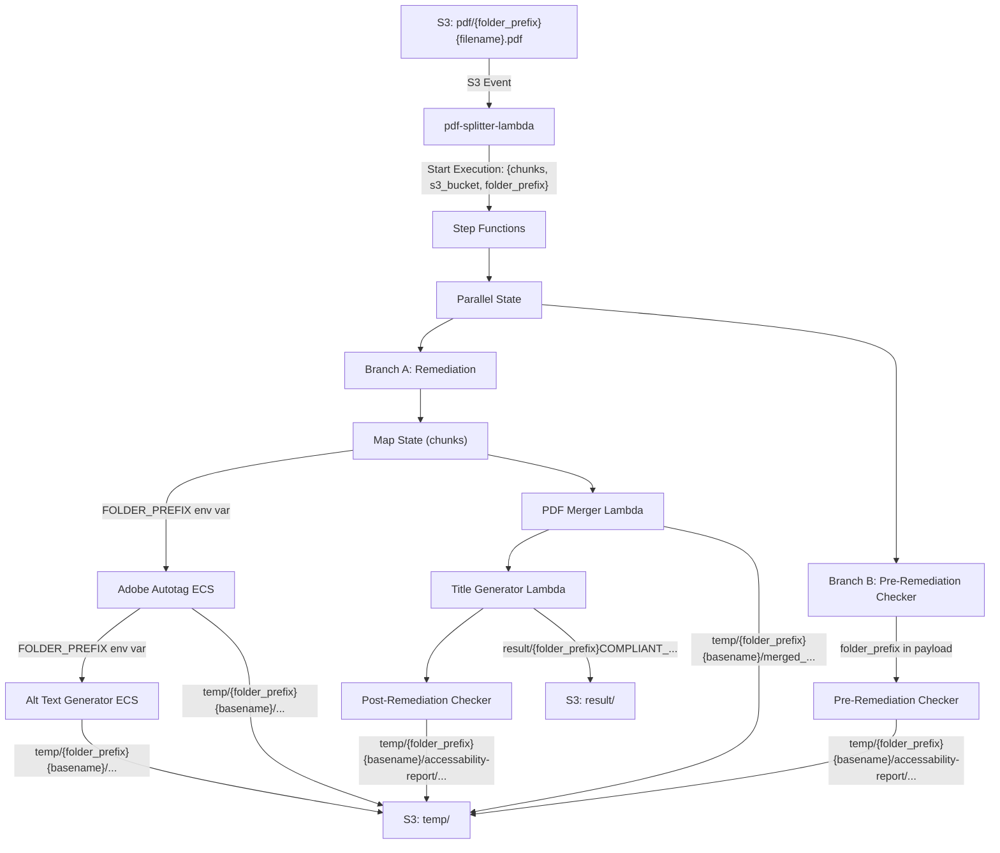

# Design Document: Folder Upload Support

## Overview

This feature adds folder-aware path handling to the existing PDF accessibility remediation pipeline. The core change is extracting a "folder prefix" from the S3 key in the entry-point lambda (pdf-splitter-lambda) and propagating it through the entire pipeline via the Step Functions state machine input and ECS environment variables.

The folder prefix is the path segment between the top-level S3 prefix (`pdf/`, `temp/`, `result/`) and the filename. For a key like `pdf/folder1/folder2/myfile.pdf`, the folder prefix is `folder1/folder2/`. For `pdf/myfile.pdf`, the folder prefix is empty string `""`.

Every component in the pipeline will be updated to prepend this folder prefix when constructing S3 paths, ensuring output files mirror the input folder structure. When the prefix is empty, all paths collapse to the current behavior — guaranteeing backward compatibility.

## Architecture

The existing pipeline architecture remains unchanged. No new AWS resources are created. The modification is purely a data-flow change: a `folder_prefix` string is added to the Step Functions input and propagated to each component.



## Components and Interfaces

### 1. pdf-splitter-lambda (`lambda/pdf-splitter-lambda/main.py`)

**Change**: Extract folder prefix from S3 key and include it in all output paths and state machine input.

**Folder prefix extraction logic**:
```python
# Given pdf_file_key = "pdf/folder1/folder2/myfile.pdf"
# Remove the "pdf/" prefix, then split off the filename
relative_path = pdf_file_key[len("pdf/"):]          # "folder1/folder2/myfile.pdf"
file_basename = relative_path.rsplit('/', 1)[-1].rsplit('.', 1)[0]  # "myfile"
if '/' in relative_path:
    folder_prefix = relative_path.rsplit('/', 1)[0] + '/'  # "folder1/folder2/"
else:
    folder_prefix = ""  # empty for flat uploads
```

**Updated chunk S3 key**: `temp/{folder_prefix}{file_basename}/{file_basename}_chunk_N.pdf`

**Updated state machine input**:
```json
{
  "chunks": [...],
  "s3_bucket": "bucket-name",
  "folder_prefix": "folder1/folder2/"
}
```

### 2. Adobe Autotag ECS (`adobe-autotag-container/adobe_autotag_processor.py`)

**Change**: Read `FOLDER_PREFIX` environment variable. Use it when constructing the `file_base_name` path component.

Currently the code does:
```python
file_key = s3_file_key.split('/')[2]
file_base_name = s3_file_key.split('/')[1]
```

This assumes `temp/{basename}/{chunk}` — a fixed 3-segment structure. With folder prefixes, the key becomes `temp/folder1/folder2/{basename}/{chunk}`, which has more segments.

**New approach**: Use `FOLDER_PREFIX` env var to determine the base name and file key:
```python
folder_prefix = os.getenv('FOLDER_PREFIX', '')
# Strip "temp/" and folder_prefix from the S3 key to get {basename}/{chunk}
remainder = s3_file_key[len("temp/") + len(folder_prefix):]
parts = remainder.split('/')
file_base_name = parts[0]  # basename
file_key = parts[1]        # chunk filename
```

All S3 paths in this file that use `temp/{file_base_name}/...` become `temp/{folder_prefix}{file_base_name}/...`.

### 3. Alt Text Generator ECS (`alt-text-generator-container/alt_text_generator.js`)

**Change**: Read `FOLDER_PREFIX` environment variable. Use it when constructing S3 paths.

Currently:
```javascript
const filebasename = process.env.S3_FILE_KEY.split("/")[1];
```

**New approach**:
```javascript
const folderPrefix = process.env.FOLDER_PREFIX || '';
// S3_FILE_KEY is like "temp/{folder_prefix}{basename}/{chunk}"
const remainder = process.env.S3_FILE_KEY.substring(("temp/" + folderPrefix).length);
const filebasename = remainder.split("/")[0];
```

All S3 paths that use `temp/${filebasename}/...` become `temp/${folderPrefix}${filebasename}/...`.

### 4. PDF Merger Lambda (`lambda/pdf-merger-lambda/.../App.java`)

**Change**: Accept `folderPrefix` from the Step Functions input. Use it when constructing the output key.

The merger receives `fileNames` (chunk keys) and currently extracts `baseFileName` from the last path component. The folder prefix will be passed as a separate field in the input.

**New input format**:
```json
{
  "fileNames": ["temp/folder1/folder2/myfile/myfile_chunk_1.pdf", ...],
  "folderPrefix": "folder1/folder2/"
}
```

**Updated output key**: `temp/{folderPrefix}{baseFileName}/merged_{baseFileName}`

**Updated return string**: The return string format stays the same but with the folder-aware path:
```
Bucket: {bucket}
Merged File Key: temp/{folderPrefix}{baseFileName}/merged_{baseFileName}.pdf
Merged File Name: {baseFileName}.pdf
```

### 5. Title Generator Lambda (`lambda/title-generator-lambda/title_generator.py`)

**Change**: Parse the folder prefix from the merged file key in the payload. Use it when saving to `result/`.

Currently:
```python
save_path = f"result/COMPLIANT_{file_key}"
```

**New approach**: Extract folder prefix from the merged file key:
```python
# merged_file_key = "temp/folder1/folder2/myfile/merged_myfile.pdf"
# Extract folder_prefix by removing "temp/" prefix and the last two path components
merged_key = file_info['merged_file_key']
parts = merged_key.split('/')
# parts = ["temp", "folder1", "folder2", "myfile", "merged_myfile.pdf"]
# folder_prefix parts are everything between "temp" and the basename directory
folder_prefix = '/'.join(parts[1:-2]) + '/' if len(parts) > 3 else ''
save_path = f"result/{folder_prefix}COMPLIANT_{file_key}"
```

### 6. Pre-Remediation Checker (`lambda/pre-remediation-accessibility-checker/main.py`)

**Change**: Receive `folder_prefix` from the state machine input. Use it when downloading the original PDF and saving the report.

Currently downloads from: `pdf/{file_basename}` (flat path)
Currently saves to: `temp/{file_key_without_extension}/accessability-report/...`

**New approach**:
```python
folder_prefix = event.get('folder_prefix', '')
# Download from full path
s3.download_file(bucket_name, f"pdf/{folder_prefix}{file_basename}", local_path)
# Save report to folder-aware path
bucket_save_path = f"temp/{folder_prefix}{file_key_without_extension}/accessability-report/..."
```

### 7. Post-Remediation Checker (`lambda/post-remediation-accessibility-checker/main.py`)

**Change**: Extract folder prefix from the `save_path` in the event payload. Use it when saving the report.

The `save_path` from the title generator will now be `result/{folder_prefix}COMPLIANT_{filename}`. The post-remediation checker can extract the folder prefix from this path.

```python
# save_path = "result/folder1/folder2/COMPLIANT_myfile.pdf"
# Extract folder_prefix: everything between "result/" and "COMPLIANT_"
path_after_result = save_path[len("result/"):]
compliant_index = path_after_result.index("COMPLIANT_")
folder_prefix = path_after_result[:compliant_index]
# folder_prefix = "folder1/folder2/"

bucket_save_path = f"temp/{folder_prefix}{file_key_without_compliant}/accessability-report/..."
```

### 8. CDK Stack (`app.py`)

**Change**: Pass `FOLDER_PREFIX` environment variable to both ECS tasks. Pass `folder_prefix` to the merger lambda input.

For ECS tasks, add a new `TaskEnvironmentVariable`:
```python
tasks.TaskEnvironmentVariable(
    name="FOLDER_PREFIX",
    value=sfn.JsonPath.string_at("$.folder_prefix")
)
```

For the merger lambda, update the payload to include `folderPrefix`:
```python
payload=sfn.TaskInput.from_object({
    "fileNames.$": "$.chunks[*].s3_key",
    "folderPrefix.$": "$.folder_prefix"
})
```

Note: The `folder_prefix` field flows through the state machine input. The Map state iterates over `$.chunks`, but each chunk item inherits the top-level `folder_prefix` through the state machine context. For the ECS tasks inside the Map state, the `folder_prefix` needs to be available at the item level or passed from the top-level input. The simplest approach is to include `folder_prefix` in each chunk object in the splitter lambda.

**Revised approach for Map state**: Include `folder_prefix` in each chunk object:
```python
chunks.append({
    "s3_bucket": bucket_name,
    "s3_key": s3_key,
    "chunk_key": s3_key,
    "folder_prefix": folder_prefix
})
```

Then in CDK, the ECS environment variable references `$.folder_prefix` from the chunk item.

For the merger and pre-remediation checker (which receive the top-level state), `folder_prefix` is also included at the top level of the state machine input.

### 9. FEATURE-CHANGES.md

A new file at the project root documenting all changes made, the files modified, and the folder prefix propagation approach.

## Data Models

### Step Functions Input (updated)

```json
{
  "chunks": [
    {
      "s3_bucket": "bucket-name",
      "s3_key": "temp/folder1/folder2/myfile/myfile_chunk_1.pdf",
      "chunk_key": "temp/folder1/folder2/myfile/myfile_chunk_1.pdf",
      "folder_prefix": "folder1/folder2/"
    }
  ],
  "s3_bucket": "bucket-name",
  "folder_prefix": "folder1/folder2/"
}
```

### Folder Prefix Values

| Input S3 Key | Folder Prefix | File Basename |
|---|---|---|
| `pdf/myfile.pdf` | `""` (empty) | `myfile` |
| `pdf/folder1/myfile.pdf` | `folder1/` | `myfile` |
| `pdf/folder1/folder2/myfile.pdf` | `folder1/folder2/` | `myfile` |

### Output Path Patterns

| Component | Current Path | Folder-Aware Path |
|---|---|---|
| Splitter chunks | `temp/{basename}/{basename}_chunk_N.pdf` | `temp/{fp}{basename}/{basename}_chunk_N.pdf` |
| Autotag output | `temp/{basename}/output_autotag/COMPLIANT_{chunk}` | `temp/{fp}{basename}/output_autotag/COMPLIANT_{chunk}` |
| Autotag images | `temp/{basename}/output_autotag/images/...` | `temp/{fp}{basename}/output_autotag/images/...` |
| Alt text output | `temp/{basename}/FINAL_{chunk}` | `temp/{fp}{basename}/FINAL_{chunk}` |
| Merged PDF | `temp/{basename}/merged_{basename}.pdf` | `temp/{fp}{basename}/merged_{basename}.pdf` |
| Final result | `result/COMPLIANT_{filename}` | `result/{fp}COMPLIANT_{filename}` |
| Pre-remediation report | `temp/{basename}/accessability-report/...` | `temp/{fp}{basename}/accessability-report/...` |
| Post-remediation report | `temp/{basename}/accessability-report/...` | `temp/{fp}{basename}/accessability-report/...` |

Where `{fp}` = folder prefix (empty string for flat uploads).


## Correctness Properties

*A property is a characteristic or behavior that should hold true across all valid executions of a system — essentially, a formal statement about what the system should do. Properties serve as the bridge between human-readable specifications and machine-verifiable correctness guarantees.*

This feature is primarily about string manipulation — extracting folder prefixes from S3 keys and constructing output paths. The core correctness concern is that every component constructs paths correctly for any folder depth (including zero depth for backward compatibility).

### Property 1: Folder prefix extraction and chunk path construction

*For any* valid S3 key of the form `pdf/{arbitrary_folders}/{filename}.pdf` (including zero folders), extracting the folder prefix and file basename, then constructing the chunk path, SHALL produce `temp/{folder_prefix}{basename}/{basename}_chunk_N.pdf` where `{folder_prefix}` is the path between `pdf/` and the filename (with trailing slash if non-empty), and `{basename}` is the filename without extension.

**Validates: Requirements 1.1, 1.2, 1.4, 7.1, 7.2**

### Property 2: Adobe Autotag path construction

*For any* folder prefix (including empty string) and S3 file key of the form `temp/{folder_prefix}{basename}/{chunk_filename}`, the Adobe Autotag container SHALL extract the correct `file_base_name` and `file_key`, and construct download paths as `temp/{folder_prefix}{file_base_name}/{file_key}` and upload paths as `temp/{folder_prefix}{file_base_name}/output_autotag/COMPLIANT_{file_key}`.

**Validates: Requirements 2.2, 2.4**

### Property 3: Alt Text Generator path construction

*For any* folder prefix (including empty string) and S3 file key, the Alt Text Generator container SHALL extract the correct `filebasename` and construct paths under `temp/{folder_prefix}{filebasename}/`, producing download paths for autotag output and upload paths for `FINAL_` prefixed chunks.

**Validates: Requirements 2.3, 2.5**

### Property 4: PDF Merger output path construction

*For any* folder prefix (including empty string) and list of chunk keys, the PDF Merger Lambda SHALL construct the output key as `temp/{folder_prefix}{baseFileName}/merged_{baseFileName}` and include this path in its return string.

**Validates: Requirements 3.1, 3.2, 3.3**

### Property 5: Title Generator result path construction

*For any* merged file key of the form `temp/{folder_prefix}{basename}/merged_{basename}.pdf`, the Title Generator Lambda SHALL extract the folder prefix and save the result to `result/{folder_prefix}COMPLIANT_{basename}.pdf`.

**Validates: Requirements 4.1, 4.2**

### Property 6: Pre-Remediation Checker path construction

*For any* folder prefix (including empty string) and filename, the Pre-Remediation Checker SHALL construct the download path as `pdf/{folder_prefix}{filename}` and the report save path as `temp/{folder_prefix}{basename}/accessability-report/{basename}_accessibility_report_before_remidiation.json`.

**Validates: Requirements 5.1, 5.2, 5.4**

### Property 7: Post-Remediation Checker path construction

*For any* save path of the form `result/{folder_prefix}COMPLIANT_{filename}`, the Post-Remediation Checker SHALL extract the folder prefix and construct the report save path as `temp/{folder_prefix}{basename}/accessability-report/COMPLIANT_{basename}_accessibility_report_after_remidiation.json`.

**Validates: Requirements 5.3, 5.5**

## Error Handling

No new error conditions are introduced by this feature. The folder prefix is a simple string extracted from the S3 key. If the S3 key has no folder (e.g., `pdf/myfile.pdf`), the prefix is empty string, and all paths collapse to current behavior.

Existing error handling in each component (try/except blocks, logging, status codes) remains unchanged. The only risk is malformed S3 keys, which are already handled by the existing S3 event notification filters (prefix=`pdf/`, suffix=`.pdf`).

## Testing Strategy

### Property-Based Tests (pytest with Hypothesis)

Since this feature is fundamentally about string manipulation (path extraction and construction), property-based testing is well-suited for the Python components. Use `pytest` with `hypothesis` for the Python path logic.

Each property test should:
- Generate random folder structures (0 to 5 levels deep) with random folder names
- Generate random PDF filenames
- Verify the path construction logic produces correct results
- Run a minimum of 100 iterations

The Java merger lambda path logic should be tested with JUnit parameterized tests covering various folder depths, since the project doesn't have a PBT library set up for Java.

The JavaScript alt text generator path logic should be tested with a simple Node.js test using `fast-check` or manual parameterized tests.

**Given the project has no existing test framework**, the testing tasks will set up pytest + hypothesis for the Python components only, focusing on the path manipulation utility functions. The Java and JS components will use example-based tests.

### Unit Tests

Unit tests should cover:
- Edge cases: empty folder prefix, single-level folder, deeply nested folders
- Special characters in folder/file names (spaces, hyphens, underscores)
- The backward compatibility case: `pdf/myfile.pdf` producing identical paths to current behavior

### Test Tagging

Each property test must be tagged with:
- **Feature: folder-upload-support, Property {N}: {property_text}**
